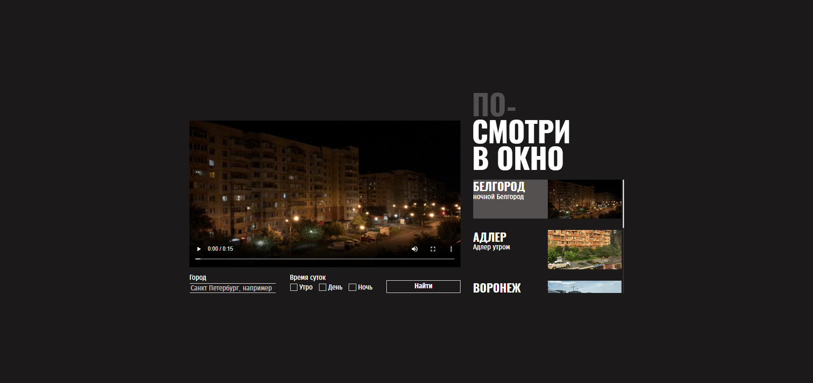

# Проект "Посмотри в окно"

[Просмотреть проект на GitHub](https://github.com/nikita-pugachev/posmotri-v-okno-fd.git)

[Посмотреть проект на GitHub Pages](https://nikita-pugachev.github.io/posmotri-v-okno-fd/)

## О проекте
Проект "Посмотри в окно" это сайт, на котором можно посмотеть на город в разное время дня. Это уже вторая моя работа в роли начинающего Frontend-разработчика. Для проекта нужно было написать стили, этот навык мне необходим для работы в команде, чтобы я мог быстро ориентироваться в чужом коде и работать с ним. Так же тут впервые затрагивается JavaScript, испльзуются темплейты, которые в данном проекте нужны для того, чтобы показывать видео того города, который выбирает пользователь. Также, при работе над проектом я впервые познакомился с обработчиками событий в JS. Как итог - впервые познакомился с проектом, с логикой на JS и научился работать с чужим кодом.

## Обновления
Думаю можно добавить сайту такой функционал, чтобы видео запрашивались с сервера, это поможет расширить список городов, на которые сможет посмотреть пользователь.

## Взгляд на проект
<div align="center">

</div>

## Используемые технологии
* HTML
* CSS
* JavaScript

## Установка и запуск
**1. Клонирование репозитория**
```bash
git@github.com:nikita-pugachev/posmotri-v-okno-fd.git
```
**2.Запуск**
* Открыть проект в VS Code
* [Установить плагин Live Server](https://marketplace.visualstudio.com/items?itemName=ritwickdey.LiveServer)
* Открыть просмотр проекта в любом браузере с помощью кнопки Go Live